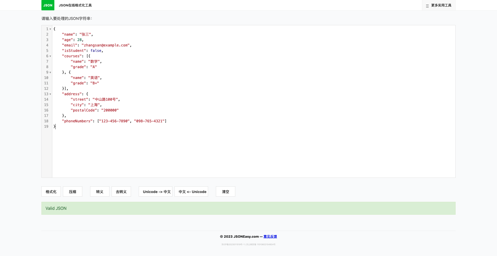

# JSON Format & Tools

A comprehensive web-based JSON toolkit that provides JSON formatting, validation, and additional utilities.

## 🚀 Features

- **JSON Formatter & Validator**
  - Format JSON with customizable indentation
  - Validate JSON syntax
  - Real-time error detection and highlighting
  - Copy formatted JSON to clipboard

- **User Feedback System**
  - Integrated feedback collection
  - User-friendly interface
  - Easy submission process

## 🌟 Screenshots  



*Above: A screenshot of the JSON Formatter in action.*

## 🛠️ Technologies

- HTML5
- CSS3
- JavaScript (Vanilla)
- Third-party libraries (located in `third-party-libs/`)

## 🚦 Getting Started

1. Clone the repository:
```bash
git clone https://github.com/[your-username]/[repository-name].git
```

2. Open `JsonFormat.html` in your web browser to start using the JSON formatter.

3. No build process or installation required - it's ready to use!

## 💡 Usage

### JSON Formatter
- Paste your JSON into the input area
- Click "Format" to beautify your JSON
- The tool will automatically validate your JSON and highlight any errors

### Date Calculator
- Navigate to `date-calculator.html`
- Input your dates and choose the calculation type
- Get instant results for date differences or calculations

## 🤝 Contributing

Contributions are welcome! Please feel free to submit a Pull Request.

1. Fork the project
2. Create your feature branch (`git checkout -b feature/AmazingFeature`)
3. Commit your changes (`git commit -m 'Add some AmazingFeature'`)
4. Push to the branch (`git push origin feature/AmazingFeature`)
5. Open a Pull Request

## 📝 License

This project is licensed under the MIT License - see the [LICENSE](LICENSE) file for details.

## 🙏 Acknowledgments

- [List any third-party libraries or resources you used]
- [Any contributors or inspirations] 